<!--
Required copyright information for w3c_slidy:

   Copyright (c) 2005-2013 W3C (MIT, ERCIM, Keio), All Rights Reserved.
   W3C liability, trademark, document use and software licensing
   rules apply, see:

   http://www.w3.org/Consortium/Legal/copyright-documents
   http://www.w3.org/Consortium/Legal/copyright-software

   Defines single name "w3c_slidy" in global namespace
   Adds event handlers without trampling on any others

-->

<!DOCTYPE html PUBLIC "-//W3C//DTD XHTML 1.0 Transitional//EN"
    "http://www.w3.org/TR/xhtml1/DTD/xhtml1-transitional.dtd">
<html lang="en-US" xmlns="http://www.w3.org/1999/xhtml">
<head>
<meta http-equiv="Content-Type" content="text/html; charset=utf-8" />
<meta name="font-size-adjustment" content="-2" />
<link rel="stylesheet" href="slidy.css" type="text/css" />
<link rel="stylesheet" href="w3c-blue.css" type="text/css" />
<script src="slidy.js" charset="utf-8" type="text/javascript">
</script>
</head>
<body>
<div class="background"></a></object></div>
<div class="background slanty">

</div>
<div class="slide cover title">

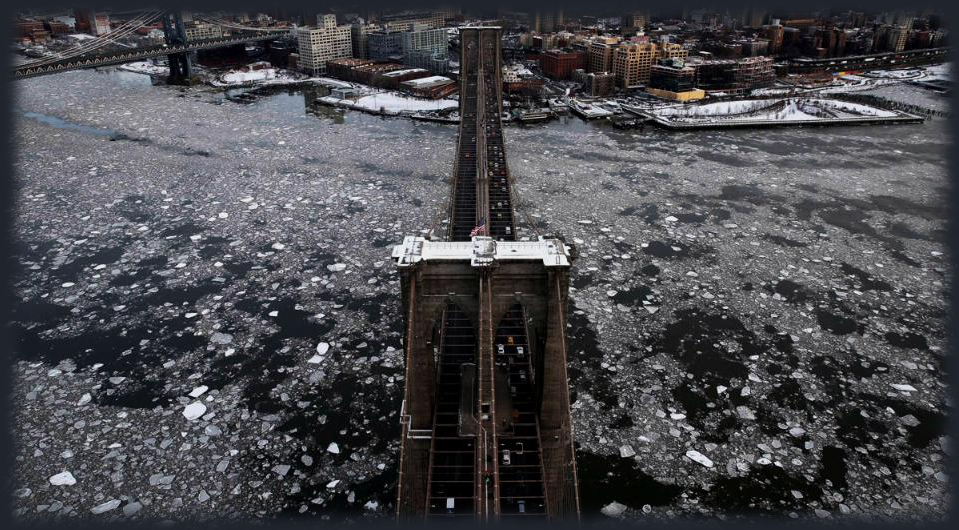<br clear="all" />
<h1>NYC Chaos Day</h1>

<h2>team name</h2><br />
<br />
<br />
<br />
<br /><em>Hit the space bar or swipe left for next slide</em></p>
</div>

<!--            Intro             -->
<div class="slide">
<br/>
<center><font size="6" color ='#ffffff'> Introduction </font></center>
<br />
<br />
<br />

<div class="container">

<p style="font-size:40px">
Analyzing the <b>worst</b> day </p> </br>

<div align="center"> 
<p style="font-size:60px">
New York </p> </br>
</div>

<font size="12">
&nbsp;&nbsp;&nbsp;&nbsp;&nbsp;&nbsp;&nbsp;&nbsp;&nbsp;&nbsp;
&nbsp;&nbsp;&nbsp;&nbsp;&nbsp;&nbsp;&nbsp;&nbsp;&nbsp;&nbsp;
&nbsp;&nbsp;&nbsp;&nbsp;&nbsp;&nbsp;&nbsp;&nbsp;&nbsp;&nbsp;
&nbsp;&nbsp;
has experienced </font> </br> </br>

<font size="6">
&nbsp;&nbsp;&nbsp;&nbsp;&nbsp;&nbsp;&nbsp;&nbsp;&nbsp;&nbsp;
&nbsp;&nbsp;&nbsp;&nbsp;&nbsp;&nbsp;&nbsp;&nbsp;&nbsp;&nbsp;
&nbsp;&nbsp;&nbsp;&nbsp;&nbsp;&nbsp;&nbsp;&nbsp;&nbsp;&nbsp;
&nbsp;&nbsp;&nbsp;&nbsp;&nbsp;&nbsp;&nbsp;&nbsp;&nbsp;&nbsp;
&nbsp;&nbsp;&nbsp;&nbsp;&nbsp;&nbsp;&nbsp;&nbsp;&nbsp;&nbsp;
&nbsp;&nbsp;&nbsp;&nbsp;
&nbsp;&nbsp;&nbsp;&nbsp;
in the past few years </font> </br> </br>
<div align = "right">
<font size="6">
in terms of 311 complains</font>
</div>
</div>
</div>


<!--            Identification             -->
<div class="slide">
<br/>
<center><font size="6" color ='#ffffff'> Identification of “Chaos Day”
 </font></center>
<br />
<br />
<br />

   <li>Utilized Anomaly Detector to analyze anomalies that occurred within all different complaints, and total complaints.</li>
   <li>In total the anomaly detector picks up 2914 Days that have Anomalies, 194 Unique Complaints, 599144 Number of Complaints</li>
   <li>Within the graphs below you can see on the left plot, a time series of all of the complaints per day for the entire 311 data set. Anomalies are identified with blue points on the graph, which can be positive anomalies or negative anomalies.</li>
<li>The package ignores seasonality, which was important due to complaints that only occur during specific times of the year,such as Heat and Hot Water below</li>
<li>It was also suspicious that many of the anomalies occur after the following work day from New Years. We chose a day that had ample work time in between New Years Eve, and our new Chaos Day.</li>
<li>January 8th, 2015 was chosen specifically because of its number of complaints, in 2015 was when 311 started to record 311 complaints throughout the day including hour and minute.</li>
</ul>

<br />

<div>
  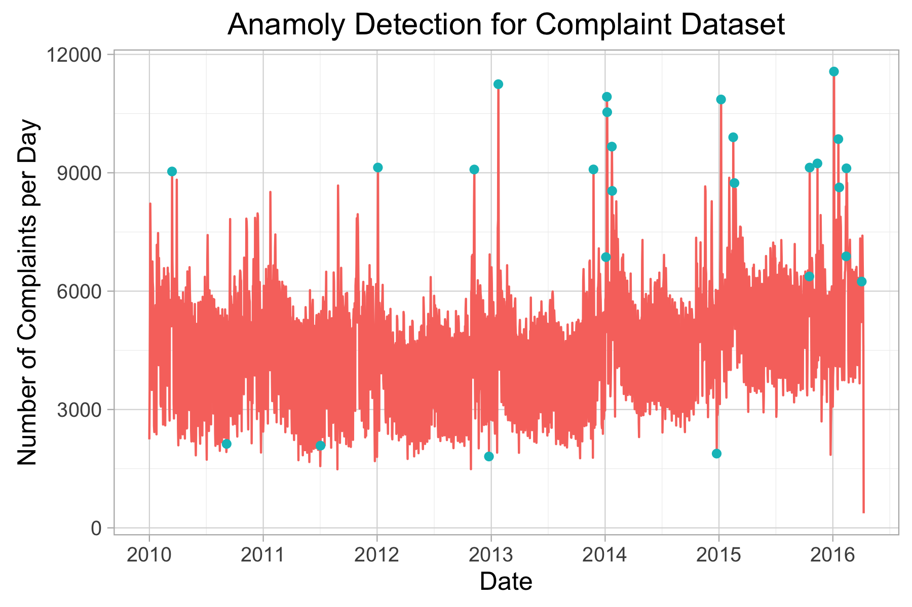
  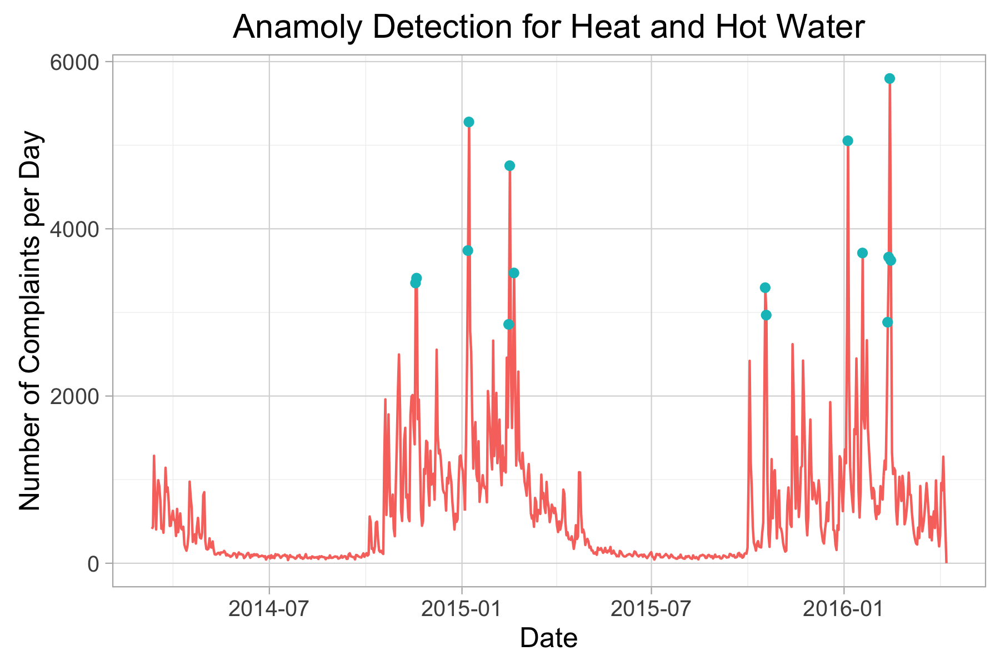
</div>


<li>We also wanted to take a look at any anomalies that may have occurred on January 8th 2015. We used the anomaly detector to scan every complaint (aggregated per day) for the entire 311 data set.</li>
<li>The detector was able to pick up 6 anomalies that were associated with the Chaos Day. They are displayed on the Bar Chart below.</li>
<li>Displayed on the right side shows some of those anomalies (matched by color) throughout the 311 data set, with the anomalies indicated by the red points.</li>
</ul>
<br />

<div>
  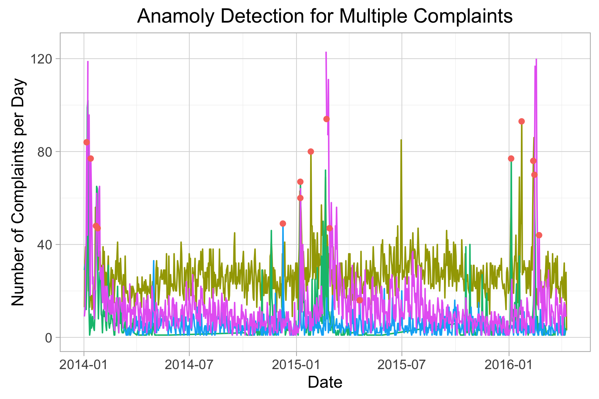
  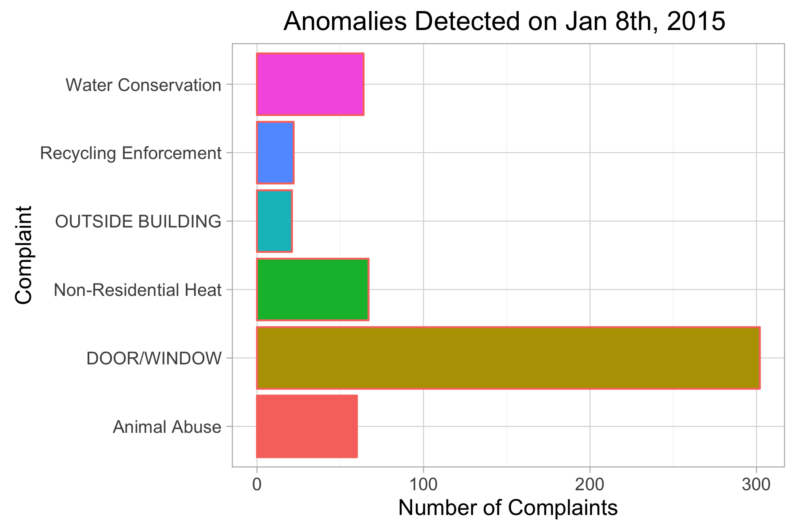
</div>
</div>


<!--            Web analysis             -->
<div class="slide">
<br/>
<center><font size="5" color ='#ffffff'> Web analysis </font></center>
<br />
<br />
<br />

<p style="text-align: left; font-size:22px;">In The News</p>

March 8 2015 made the news. There were 4 times more articles about the cold weather in NYC than a usual day
```{r, echo=FALSE, warning=FALSE, message=FALSE, fig.height = 3, fig.align='center'}
coldnews <- read.csv('Gary-ggs2121/newscold3.csv', header = TRUE)
coldnews <- coldnews[-1]

if (!require("ggplot2")) {
  install.packages("ggplot2")
}
library("ggplot2")
ggplot(coldnews, aes(date,y = number.of.articles)) + geom_bar(stat = "identity", fill="#56B4E9")
```

Example of news linked to complaints

  <span style="float:left;width: 50%;">
  
  </span>
  <span style="float:right;width: 50%;">
  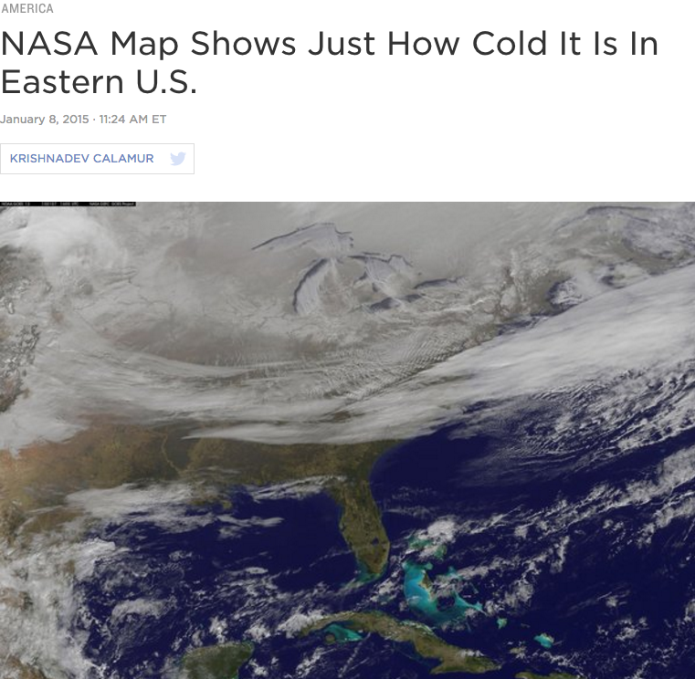
  </span>
<br />
&nbsp;
&nbsp;
 <p>
<p style="text-align: left; font-size:22px;">On Social Media</p>
<p style="text-align: left;">On twitter, we noticed a number of user that complaint about cold weather. Regular citizen may complaint on 311 and on the internet at the same time.</p>
Example of tweets linked to complaints

  <span style="float:left;width: 50%;">
  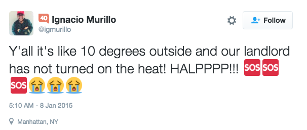
  </span>
  <span style="float:right;width: 50%;">
  
  </span>
<br />
  <span style="float:center;width: 100%;">
       <br />    
  </span>
  &nbsp;
  &nbsp;
  
  <p>
<p style="text-align: left; font-size:22px;">On Google</p>
So journalists and Internet users talk about this chaotic day but to see if it has a real impact on 311, we also analyzed Google search through the Google trend tool. We noticed a clear peak 

<span style="float:center;width: 100%;">
  
  </span>
</div>

</div>


<!--            Complaint Types and Descriptors Analysis             -->
<div class="slide">
<br/>
<center><font size="6" color ='#ffffff'> Complaint Types and Descriptors Analysis </font></center>
<br />
<br />
<br />

```{r, echo=FALSE, warning=FALSE, message=FALSE}
library(RColorBrewer)
library(plotly)
library(dplyr)
```
<p>To analyze the complaints of the week surrounding January 8 2015, we pick the period of 01/05/2015 - 01/11/2015 and plot of the counts of the top five complaints of the week. We can see that complaints of Heat/Hot Water is more than 10 time of the second most type of complaints, which is expected because it is one of the coldest day of the year. we can see that the second most is Blocked Driveway and the third is plumbing, which makes sense given the weather condition.</p>
<center>
```{r, echo=FALSE, warning=FALSE, message=FALSE}

load("sf2599_final/sum_complaint.Rda")

colors1 = brewer.pal(5,"RdYlGn")

c_sum <- plot_ly(
  data=complaint_summary,
  x = n,
  y = type,
  name = "Complaint Type Count of Week of January 8, 2015",
  type = "bar",
  marker = list(color = colors1), orientation = 'h'
) %>%
  layout(margin = list(l=150))
c_sum
```
</center>
<p>Now we are interested in when these five types complaints are reported. With some preliminary statistics, we find that out of the 19833 complaints of Heat/Hot Water, 19832 of them are logged at 12AM, which means it is not likely to represent the real time of the complaints. Further, 96.6% of total unsanitary condition complaints and 98.6% of total plumbing complaints are logged at 12AM. As a result, we pick other time points of the day to do our analysis. Specifically, given that the complaints are reported at discreet time point with random time interval in between, we choose bar plot to show the count of the top five complaints of each hour we pick. Below is our plot showing the counts of complaints for 3AM, 6AM, 9AM, 12PM, 3PM, 6PM, 9PM. We can see that there are most Blocked Driveway complaints around 9AM, 3PM, and 9PM. And there are most Street Light complaints around 9AM and 3PM. </p>
<center>
```{r, echo=FALSE, warning=FALSE, message=FALSE}
# Bar plot of complaint types of selected hours
load("sf2599_final/byhour_complaint.Rda")

plot_ly(data=Hourly[6:40,], x=hour, y=count, color=type, type='bar')
```
</center>

<p>Next, we look at the descriptors of the complaints of the week surrounding January 8 2015. Similarly, we pick the period of 01/05/2015 - 01/11/2015 and plot of the counts of the top five descriptors of the week. As expected, the top descriptors are Entire Building and Apartment Only, which are associated with Heat/Hot Water complaints. The third most is Street Light Out, which is associated with complaints of Street Light Condition.</p>

<center>
```{r, echo=FALSE, warning=FALSE, message=FALSE}
#Plot total number of each descriptor

load("sf2599_final/desc_sum.Rda")

colors2 = brewer.pal(5,"RdYlBu")

d_sum <- plot_ly(
  data=desc_summary,
  x = n,
  y = descriptor,
  name = "Descriptor Type Count of Week of January 8, 2015",
  type = "bar",
  marker = list(color = colors2), orientation = 'h'
) %>%
  layout(margin = list(l=150))
d_sum
```
</center>

<p>Similar to how we plot the counts of complaints throughout the day, we plot the counts of descriptors for 3AM, 6AM, 9AM, 12PM, 3PM, 6PM, 9PM using reactive bar charts. We can see that there are most descriptors about no access at 9AM and the amount of descriptors about no access is quite stable from 12PM to 9PM. Note that there are most descriptors about Pothole and Street Light Out at 3PM.</p>

<center>
```{r, echo=FALSE, warning=FALSE, message=FALSE}
# Bar plot of descriptor of selected hours 

load("sf2599_final/byhour_descriptors.Rda")
plot_ly(data=Hourly_2[6:40,], x=hour, y=count, color=type, type='bar')

```
</center>

<br />
</div>


<!--            Exploration             -->
<div class="slide">
<br/>
<center><font size="6" color ='#ffffff'> Exploring Complaints </font></center>
<br />
<br />
<br />
<p>We continue our investigation by plotting the top ten 311 complaint categories for January 8th according to census tracts as shown below. </p>
<iframe src="https://patrick-rogan.shinyapps.io/shiny/" width="100%" height="800px" frameborder="0"></iframe>
<br />
<br />
<p>We see that the complaint categories have different distributions throughout New York City. For example, heat and hot water complaints appear to be clustered around the northern edge of Manhattan, in the lower Bronx and around the center of Brooklyn. However, other categories such as unsanitary condition appear to be uniformly distributed throughout the city. </p>
</div>

<!--            Car Collisions             -->
<div class="slide">
<br/>
<center><font size="6" color ='#ffffff'> NYC Car Collisions on Jan 08, 2015 </font></center>
<br />
<br />
<br />
  <li>What made today so bad for NYC? Was it a bad day for traffic?</li>
  <li>The time lapse plot (link below) will show you the number collisions that occurred on Jan 08, 2015. The collisions will appear at the time they happened. The colors are related to the type of vehicle that was involved in the collision.</li>
</ul>

<center>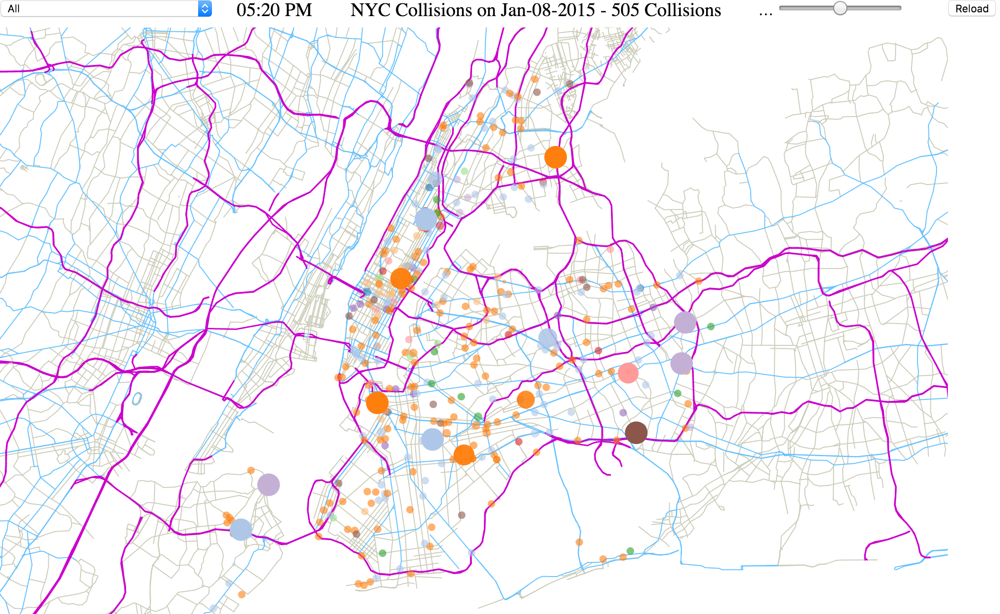</center> 
<a href="http://bl.ocks.org/minnich49/raw/fbeb70700c7c870ea016a28c4918f322/">Link to D3 NYC Car Collisions</a>
<!-- <iframe src="http://bl.ocks.org/minnich49/raw/fbeb70700c7c870ea016a28c4918f322/" marginwidth="0" marginheight="0" scrolling="no"></iframe> -->

</div>


<!--            Historical Car Collisions             -->
<div class="slide">
<br/>
<center><font size="6" color ='#ffffff'> Comparison to Historcal Collisions in NYC  </font></center>
<br />
<br />
<br />
<center>
<div>
  
  
</div>
</center>
  <li>We can see from the red line in the upper left plot, that January 8, 2015 was a pretty typical day in terms of car collisions at 505 total.</li>
  <li>There was even a day that had over 900 collisions, which was during a major winter storm and would have been a particularly bad day.</li>
  <li>To insure that this horrible day did not just affect a single burrow, the plot on the left shows the historical distributions for each Borough, where the black dot indicates January 8, 2015</li>
  <li>Still nothing abnormal about this day</li>

</ul>

</div>

<!--            Agency             -->
<div class="slide">
<br/>
<center><font size="6" color ='#ffffff'> Relationship Between Agencies, Complaints, and Boroughs </font></center>
<br/>
<br/>
<br/>
The 311 Service Requests contain many sub fields including agency and borough. Here we focus on relationship between agencies, boroughs, and complaints. We use Saneky diagrams to show the relationships between these variables. To put January 8th in perspective, we compare both the anomaly day and the complaints from an entire year. 

```{r, echo=FALSE, warning=FALSE, message=FALSE}

## Preparation for sankey diagram and work cloud
if (!require("googleVis")) {
  install.packages(c("devtools","RJSONIO", "knitr", "shiny", "httpuv"))
  library(devtools)
  install_github("mages/googleVis")
}
if (!require("wordcloud")) {
  install.packages("wordcloud")
}

library(wordcloud)
library(googleVis)
op <- options(gvis.plot.tag="chart")

#### data for sankey diagram
load("sankey_anomal_day.Rda")
load("sankey_2015_top3.Rda")

#### data for word cloud
load("word_anomal_day.Rda")

```
A Sankey diagram of anomaly day is shown below. Here we see the relationship between complaint type and agencies, as well as the relationship between agencies and boroughs. 

<p style="text-align: left; font-size:20px; font-weight:bold;">Sankey diagram between complaints, agencies, and boroughs at anomaly day</p>
<center>
```{r results='asis', tidy=TRUE, echo=FALSE, fig.align='center'}
plot(data_jan_08_output[[1]])
```
</center>
<br />
In the above diagram, there are many complaints directed to HPD (Housing Preservation & Development) on January 8th. Among these, there are 5225 complaints classified as HEAT/HOT WATER which is the largest complaint category for this day. We also see other complaints such as plumbing or DOOR/WINDOW. Furthermore we observe the relationships between agencies and boroughs. For example, the numbers of complaints directed to HPD are the largest in Brooklyn. 

Another Sankey diagram of anomaly day is shown below. In this diagram, we can see the relationship between agencies and boroughs, and the relationship between boroughs and complaints.  

<p style="text-align: left; font-size:20px; font-weight:bold;">Sankey diagram between agencies, boroughs, and complaints at anomaly day</p>
<center>
```{r results='asis', tidy=TRUE, echo=FALSE, fig.align='center'}
plot(data_jan_08_output[[2]])
```
</center>
<br />
In the diagram above, we can see the direct relationship between borough and complaint type. We can see that complaints of HEAT/HOT WATER are most prevalent in Brooklyn. From this result, we can also assume that some incidents related to water happened at the anomaly day. 

A Sankey diagram for a full year of complaints is shown below. In this diagram, we see the relationship between complaint type and agencies, and the relationship between agencies and boroughs. Here, we picked the top three agencies that had largest numbers of complaints on the anomaly day to compare the yearly data and anomaly data. 

<p style="text-align: left; font-size:20px; font-weight:bold;">Sankey diagram between complaints, agencies, and boroughs at 2015</p>
<center>
```{r results='asis', tidy=TRUE, echo=FALSE}
plot(data_2015_2016_TOP3_output[[1]])
```
</center>
<br />
In the diagram above we show the number of complaints directed to HPD, DOT or NYPD during 2015 and 2016. As we can see above, complaints of HEATING are the largest, however, complaints of HEAT/HOT WATER that was the largest numbers of complaints at anomaly day is not the largest in total. Hence, we can say that at the anomaly day, the numbers of complaints of HEAT/HOT WATER was very high compared with annual data. In addition, the numbers of complaints directed to HPD in Brooklyn was the largest (1076902), and it may be possible that houses or buildings at Brooklyn may have some issue related to water or heating.

As shown above, HPD had the most complaints. We then look at the descriptions written in these complaints. 

Here is the description information of complains directed to HPD at the anomaly day (Jan/8/2015).

```{r, echo=FALSE, fig.width = 3, fig.height = 3, fig.align='center'}
dtm = JAN_08_2015_mining_HPD[[1]]
mfreq = colSums(as.matrix(dtm))

set.seed(429) 
wordcloud(names(mfreq),mfreq,
          min.freq=0,
          scale=c(4,0.5),
          colors=brewer.pal(8, "Dark2"),
          random.color=FALSE, 
          random.order=FALSE)
```

As we can see, words that are related to housing such as 'building' and 'apartment' are prevalent. From the previous analysis about complaint type, we know that there are many HEAT/HOT WATER complaints. This word cloud is consistent with the distribution of complaints for this day.

</div>


<!--            Agency Response Time Analysis             -->
<div class="slide">
<br/>
<center><font size="6" color ='#ffffff'> Agency Response Time Analysis  </font></center>
<br />
<br />
<br />
The majority of complaints in Jan 2015 went to two agencies: HPD and DOT. We'd like to summarize the efficiency of these agencies in closing complaints assigned to them over an extended time period. <br />

Specifically, we want to look at the window between Jan 1st and Jan 15th, which is a week before/after the chaos day Jan 8th. Furthermore, we will focus on the Manhattan borough as it is where the majority of the report authors are located.
<br />

We are curious if there is any pattern within agencies. For example, whether HPD's response time to one type of complaint is affected by the other complaints? How was their efficiency in closing complaints that were created on the chaos day compared to other days? 
<br />
<br />

```{r, echo=FALSE, warning=FALSE, message=FALSE}
library(plotly)
load("HPD_manhattan.Rda")
load("DOT_manhattan.Rda")
load("HPD_corr.Rda")
load("DOT_corr.Rda")
```

<center>
```{r, echo=FALSE, fig.width=4.5, fig.height=4.5}
par(mfrow=c(1,2))
plot(HPD_corr, main="HPD response time correlation")
plot(DOT_corr, main="DOT response time correlation")
```
</center>
<br />
<p>The pair correlations between types of complaints are very random for each agency. We then move on to visualize the response time by complaint categories for two agencies. </p>
<br />
<br />
<br />
<center>
```{r, echo=FALSE, warning=FALSE, message=FALSE}
### Jan 1st to Jan 15th. 

plot_ly(data = HPD_manhattan[1:75,], x = date, y = response, type='bar',color =complaint)%>%
  layout(title="Average days for HPD to close different complaints (reported in Manhattan)")

```
</center>

HPD is relatively efficient in fixing the Heat/Hot Water complaints, which is necessary because these are more urgent when compared to other complaints during the winter days. <br />

<p>This is also the case for complaints created on Jan 8th. If the reader hovers over Jan 8th, they will see that HPD took longer time closing Plumbing, Door/Window, Unsanitary Condition, Paint/Plaster issues than closing Heat/Hot Water complaints. </p>
<br />
<br />
<center>
```{r, echo=FALSE, warning=FALSE, message=FALSE}
plot_ly(data = DOT_manhattan[1:75,], x = date, y = response, type='bar', color =complaint)%>%
  layout(title="Average days for DOT to close different complaints (reported in Manhattan)")
````
</center>

DOT's response efficiency differs among types of complaints as well, here the contrast between response times is more obvious. Highway Condition and Traffic Signal Condition are more urgent than other cases and as such the DOT may work harder to resolve these issues.
<br />

From the visualization, we do not find pattern that could summarize the agency's response time to different complaints over the week before/after Jan 8th. This is understandable as the urgency of complaints and other exogenous factors may affect the agency's efficiency. 
<br />
<br />
<br />
<br />

</div>
<!-- ############################# -->

<!--            Prediction Model Approach     -->
<div class="slide">
<br/>
<center><font size="6" color ='#ffffff'> Prediction Model - Approach </font></center>
<br />
<br />
<br />
  <li>Time series analysis was unable to accurately predict number of counts per day due to volatile changes from day to day.</li>
  <li>Turned to Random Forest Regression in order to account for highly non-linear data. While it will be shown this model has difficulties detecting anomalies, we will see that there is still a large benefit for the 311 team in knowing what their next day will be, in order to properly staff for the incoming complaints.</li>
  <li>Aggregated all of the complaints into daily counts and used the previous 4 days of information to predict the Count of that day(shown below as Day_Lag_1 to Day_Lag_4).</li>
  <li>The initial features are the previous 4 days. Count is what is attempting to be predicted.</li>
</ul>

<center>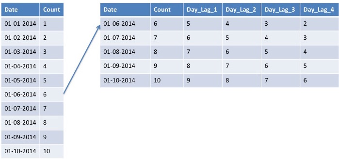</center>


</div>
<!--            Prediction Model Approach End    -->

<!--            Prediction Importance     -->
<div class="slide">
<br />

<center><font size="6" color ='#ffffff'> Prediction Model - Importance Factors </font></center>
<br />
<br />
<br />
  <li>Model 1: The upper left plot was the initial model that only included the Counts from Daily Lags</li>
  <li>Model 2: The upper right plot was the second model that added Weather (Minimum and Maximum Temp) and Month to Model 1</li>
  <li>Model 3: The lower left plot was the third model that added Change Between Lags, which is the difference between Day_Lag_1 and Day_Lag_2, Day_Lag_2 and Day_Lag_3 etc</li>
  <li>Model 4: The lower right plot was the fourth model that added Weekday, which is a label for the 7 days of the week. Sunday is 1...Saturday is 7</li>
  <li>We can see that the Change Between Lags and the Weekday had a large change on the order of importance for the Random Forest Regression.</li>
  <li>From the importance plots below it can be determined that Saturday and Fridays have added a large contribution to the final model. Surprisingly, after adding the days the Minimum and Maximum Temper importance increased.</li>

</ul>

<center>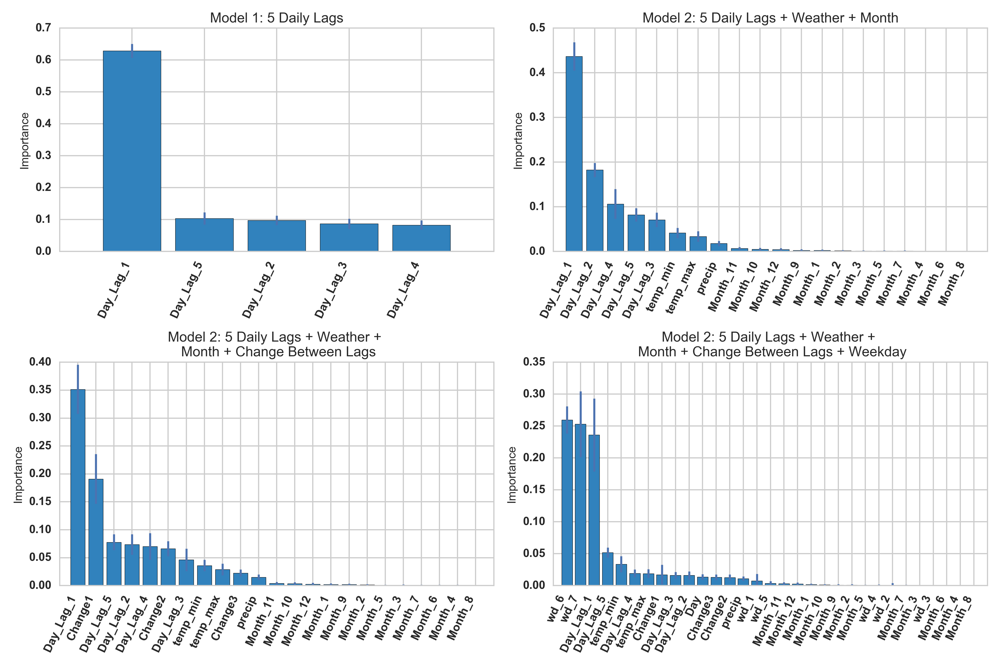</center>

</div>
<!--            Prediction Model Importance End    -->


<!--            Prediction RMSE     -->
<div class="slide">
<br/>
<center><font size="6" color ='#ffffff'> Prediction Model - RMSE </font></center>
<br />
<br />
<br />
  <li>A single prediction was made based on all of the previous days within the data set. For example, to predict January 1, 2004, all previous days were used as training to predict the next day. This was done for ~200 days, which can be seen in the plots below. </li>
  <li>For each prediction (Count) there were 4 previous days and other features,depending on the model, to help with the predictions.</li>
  <li>Root Mean Squared Error was calculated to compare models</li>
  <li>After initial testing with Random Forests the RMSE needed to improve on the more volatile days</li>
  <li>Adding the Changes Between Lags and the Weekday had the greatest improvement on RMSE, therefore Model 4 was chosen (All previous features + Weekday)</li>
</ul>


<center>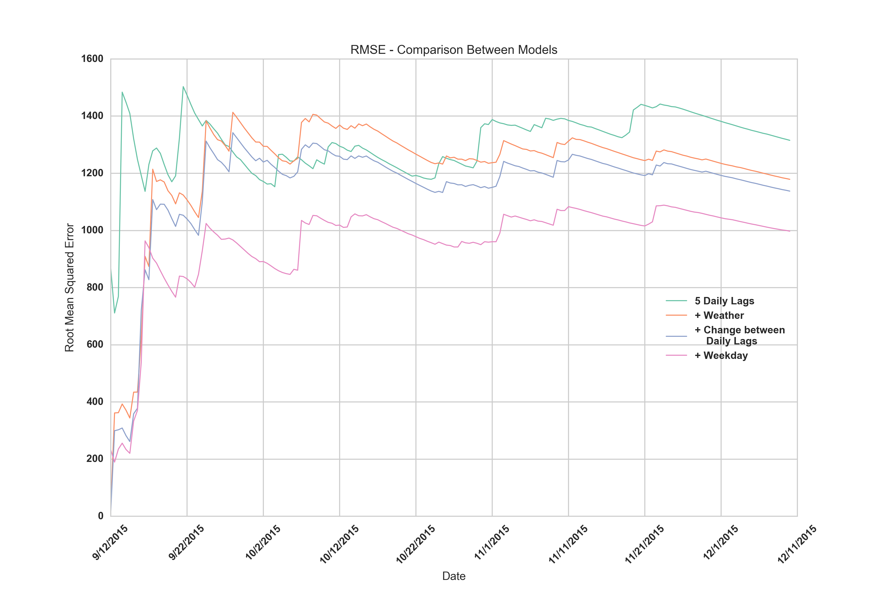</center>

</div>
<!--            Prediction Model RMSE End    -->

<!--            Prediction ModelTime Series and Conclusin/Improvements     -->
<div class="slide">
<br/>
<center><font size="6" color ='#ffffff'> Prediction Model - Predictions </font></center>
<br />
<br />
<br />
  <li>We can see from the plots below that Model 4 does a good job of following the trends that are seen within daily complaints</li>
  <li>The model has difficulties in predicting the extremely volatile days but still does a good job of holding the correct trend.</li>
  <li>The memory of the model can sometimes hurt the performance, as in between 11/21/2015 and 12/01/2015, the predictive model consistently experiences a dip</li>
  <li>So while the initial goal started out to predict anomalies, we found that most of the anomalies occurred around the days after New Years Eve, when many 311 workers would come back to work on the backlog of complaints. We believe that this model helps the 311 team understand on a day to day basis on how many complaints they will have in their next day and can help adjust their staff accordingly.</li>
</ul>

  <span style="float:center;width: 20%;">
    <center>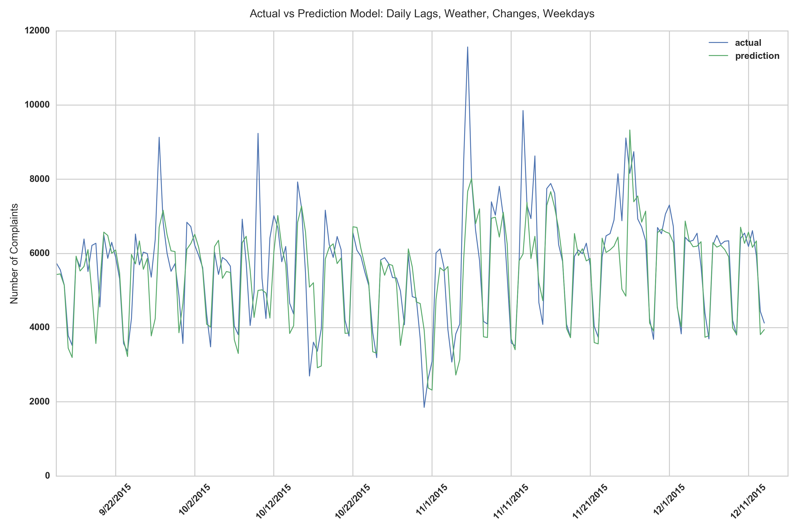</center>
  </span>
</div>
<!--            Prediction Time Series and Conclusin/Improvements     -->


<div class="slide">
<br/>
<center><font size="6" color ='#ffffff'> Conclusion </font></center>
<br />
<br />
<br />
<p>
</p>
<br />
</div>

<div class="slide">
<br/>
<center><font size="6" color ='#ffffff'> Team </font></center>
<br />
<br />
<br />
<p>
</p>
<br />
</div>

<div class="slide">
<br/>
<center><font size="6" color ='#ffffff'> References </font></center>
<br />
<br />
<br />
<p>
<b>311 | City of New York </b><br>
http://www1.nyc.gov/311/<br>
<b>NYC Car Collisions </b><br>
https://data.cityofnewyork.us/Public-Safety/NYPD-Motor-Vehicle-Collisions/h9gi-nx95<br>
</p>
<br />
</div>

