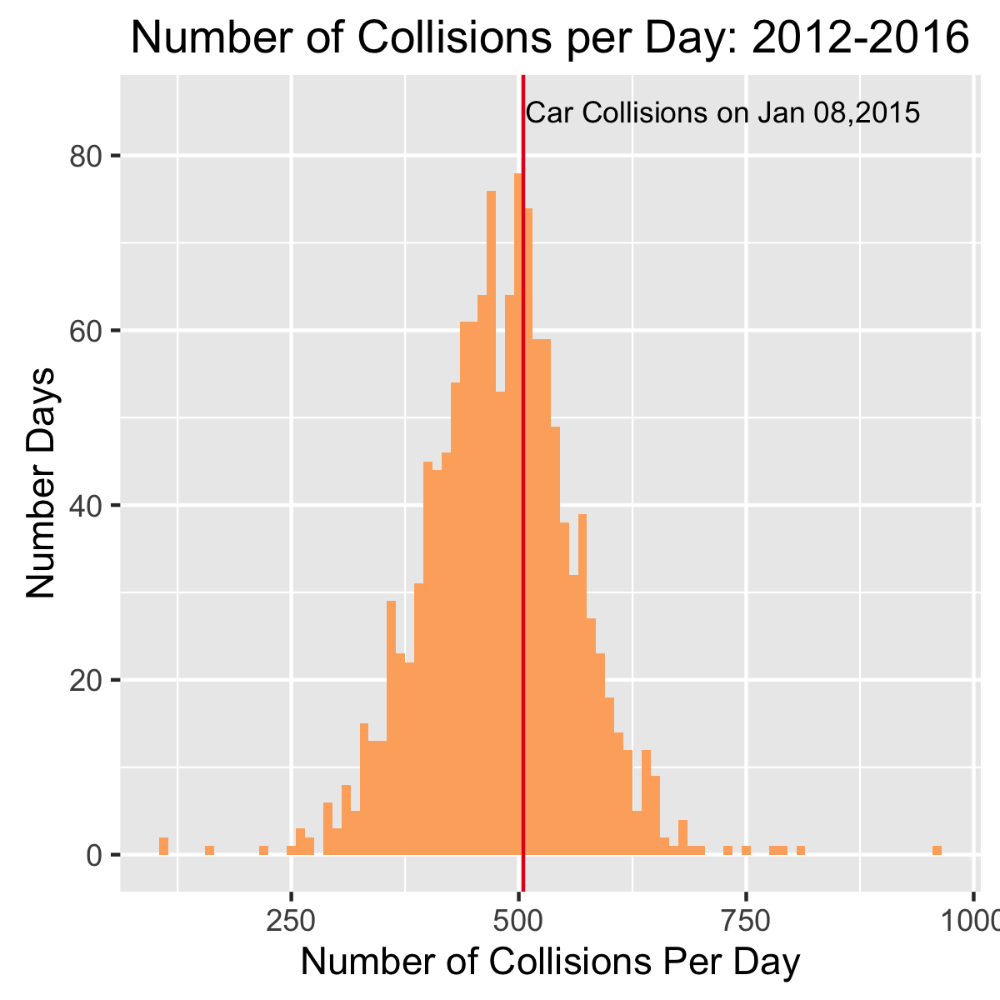
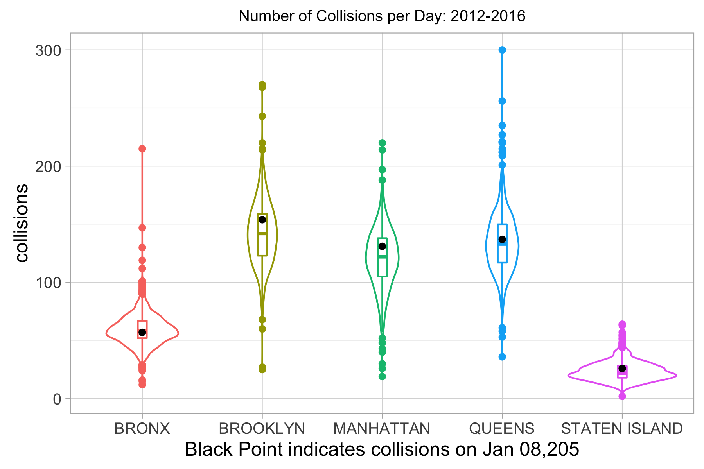

<title> EDAV Final Project </title>

<style>
  .small-skip {
     margin-bottom: 0.35cm;
  }
</style>

<font size="6"> NYC Chaos Day</font> <br>

<font size="5"> - Your Teamname Here </font>

```{r, message=F, warning=F, echo = FALSE, fig.align='center'}
library(plyr)

```


<iframe src="https://patrick-rogan.shinyapps.io/shiny/" width="100%" height="600px" frameborder="0"></iframe>

## Introduction

<br><br>
<br><br>


##NYC Car Collisions
####D3 Plot
Placeholder 
####Comparison to historcal collisions in NYC 
<div style="text-align: center;">

  <span style="float:left;width: 40%;">
  
  </span>
  
  <span style="float:right;width: 60%;">
  
  </span>
  <div style="clear: both;"></div>
</div>

<br />
<br />

## Relationship between agencies, complaints, and boroughs
At 311 Service Requests, there are many information such as agencies and boroughs. Here, we will focus on relationship between agencies, boroughs, and complaints. Some methods exist to show relationship, and we will use Saneky diagram to show the relationship. To compare the result, we will focus on both anomaly day and overal information during one year. 

```{r, echo=FALSE, warning=FALSE, message=FALSE}

## Preparation for sankey diagram and work cloud
if (!require("googleVis")) {
  install.packages(c("devtools","RJSONIO", "knitr", "shiny", "httpuv"))
  library(devtools)
  install_github("mages/googleVis")
}
if (!require("wordcloud")) {
  install.packages("wordcloud")
}

library(wordcloud)
library(googleVis)
op <- options(gvis.plot.tag="chart")

#### data for sankey diagram
load("sankey_anomal_day.Rda")
load("sankey_2015_top3.Rda")

#### data for word cloud
load("word_anomal_day.Rda")

```

Sankey diagram of anomaly day is shown below. In this Sankey diagram, we can see the relationship between complaint type and agencies,  and the relationship between agencies and boroughs. 

```{r results='asis', tidy=TRUE, echo=FALSE}
plot(data_jan_08_output[[1]])
```

At the diagram above, there are lots of complaints directed to HPD(Housing Preservation & Development) at anomaly day(Ja/08/2015). Among these complaints, the numbers of complaints of HEAT/HOT WATER are 5225, which is the largest numbers of complaints at the anomaly day. In addition, there are other complaints such as plumbing or DOOR/WINDOW. We also can see the relationship between agencies and boroughs. The numbers of complaints directed to HPD are the largest at Brooklyn. From this result, we can assume that some incidents related to water happened at Brooklyn. 

Another sankey diagram of anomaly day is shown as well. In this Sankey diagram, we can see the relationship between agencies and boroughs, and the relationship between boroughs and agencies. 

```{r results='asis', tidy=TRUE, echo=FALSE}
plot(data_jan_08_output[[2]])
```

At the diagram above, we can see the direct relationship between borough and complaint type which cannot be seen at the first diagram. We can see that complaints of HEAT/HOT WATER are the most at Brooklyn. From this result, we can also assume that some incidents related to water happened at the anomaly day. 

Sankey diagram of one year is shown below. In this Sankey diagram, we can see the relationship between complaint type and agencies, and the relationship between agencies and boroughs. Here, we picked up top 3 agencies that had largest numbers of complaints at the nomaly day(Jan/8/2015) to compare the result with yearly data and anomaly data. 

```{r results='asis', tidy=TRUE, echo=FALSE}
plot(data_2015_2016_TOP3_output[[1]])
```

At the diagram above, numbers of complaints directed to HPD, DOT or NYPD during 2015 and 2016 can be seen. As we can see above, complaints of HEATING are the largest, however, complaints of HEAT/HOT WATER that was the largest numbers of complaints at anomaly day is not the largest number. Hence, we can say that at the anomaly day, the numbers of complaints of HEAT/HOT WATER was very high compared with anual data. In addition, the numbers of complaints directed to HPD at Brooklyn was the largest (1076902), and it may be possible that houses or buildings at Brooklyn may have some issue related to water or heating. 

## Description of complaints directed to HPD
AS we seen at examples of sankey diagram, HPD had the most complaints. Then, we will look at descriptions written in complaints. 

Here is the description information of complains directed to HPD at the anomaly day (Jan/8/2015).

```{r, echo=FALSE}
dtm = JAN_08_2015_mining_HPD[[1]]
mfreq = colSums(as.matrix(dtm))

set.seed(429) 
wordcloud(names(mfreq),mfreq,
          min.freq=0,
          scale=c(4,0.5),
          colors=brewer.pal(8, "Dark2"),
          random.color=FALSE, 
          random.order=FALSE)
```

As we can see above, words that are related to housing such as building, apartment are picked up. From the previous analysis about complaint type, we know that there are lots of HEAT/HOT WATER complaints. From this wordcloud, we can assume that there would be lots of complaints related to building and apartment.


## References
Example Reference. https://www.e <br>

